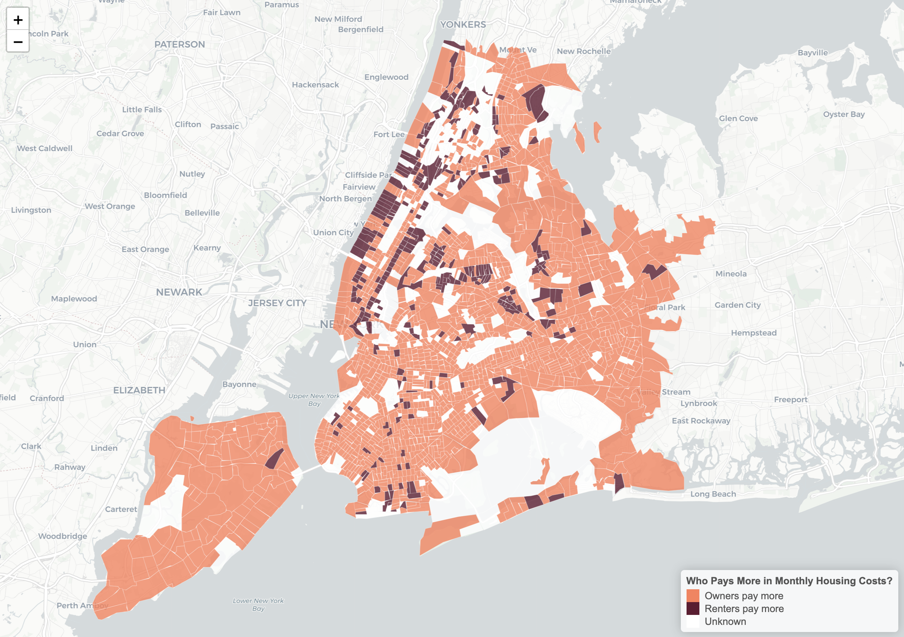
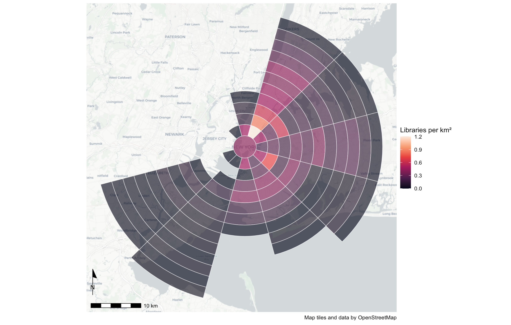
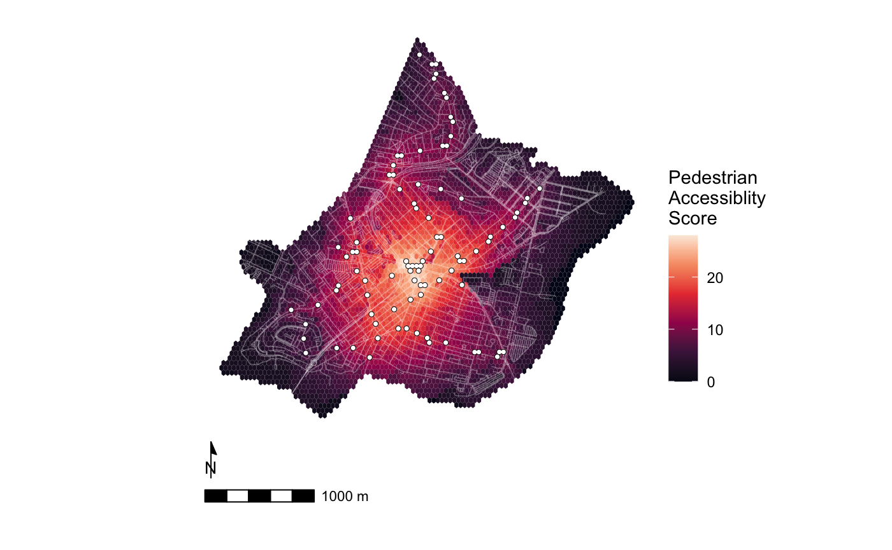
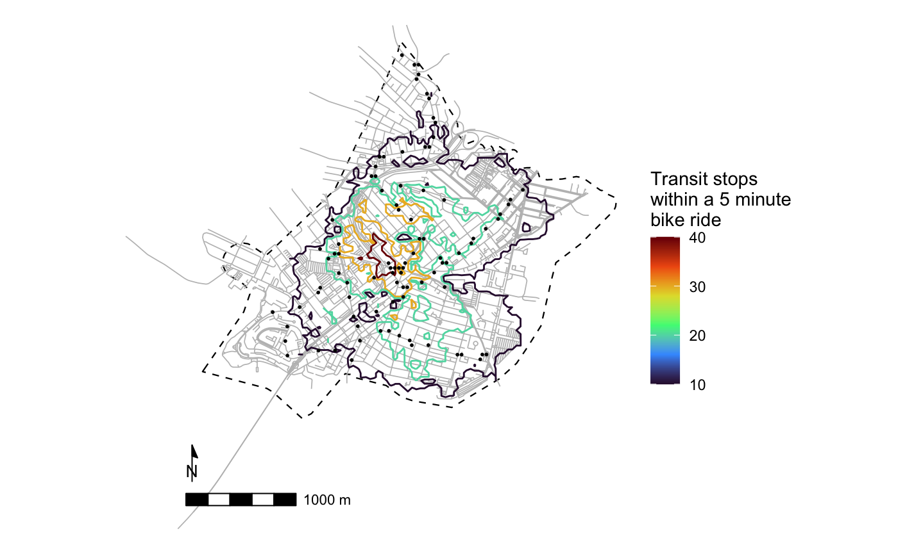
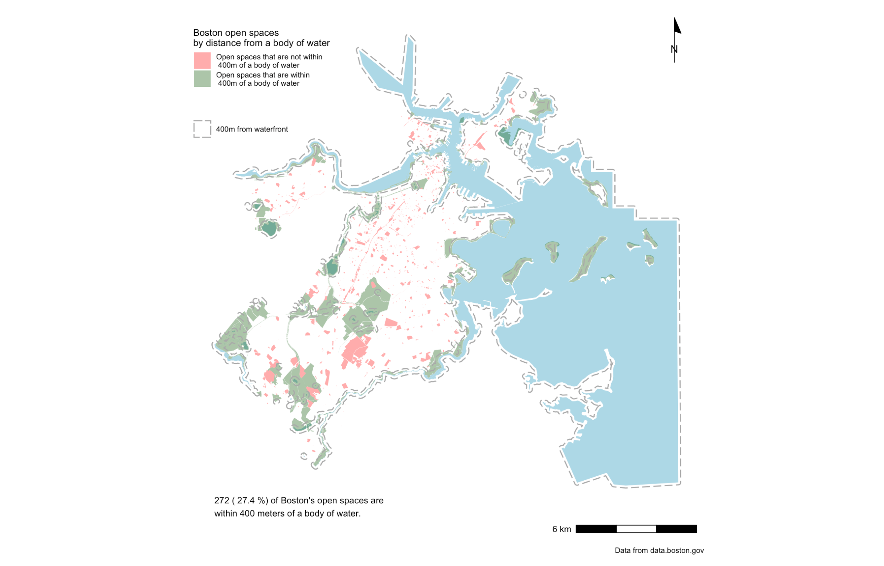

```{r setup, include=FALSE}
knitr::opts_chunk$set(echo = TRUE)
```

# Introduction  
This portfolio demonstrates the skills learned in VIS 2128: Spatial Analysis, namely using R, RStudio, and ArcGIS to create various maps analyzing and displaying urban data across a range of cities. 

# Maps of New York City  

## Interactive Housing Cost Map  
The rising costs of housing in NYC are an ever-talked-about urban planning issue, with much of that conversation focusing on rent and renters. While this is understandable given that about 68% of households are renter-occupied, it prompted me to wonder how the monthly costs of rent compare to the monthly cost of ownership (not including initial cost of purchase). This interactive map explores that comparison by indicating whether costs of owning or renting are greater in different census tracts of New York City. The data displayed comes from the 2019 American Community Survey (ACS), specifically Median Gross Rent (B25064_001) and Selected Monthly Owner Costs (B25094_001). 

This interactive map demonstrates the following skills:

* Displaying data on an interactive map  
  
[](https://mpkhinda.github.io/Spatial-Analysis-Portfolio/Assets/NYCHousingCostMap.html){target="_blank"}


## Library Density Map  
This map displays the density of public libraries in NYC per square kilometer. To do so, it employs a radial grid, centered on lower Manhattan, which clearly illustrates the higher concentration of libraries in Manhattan, Queens, and Brooklyn as compared to Staten Island and The Bronx. This map, however, does not consider the libraries' accessibility, amenities, or other important information about quality of service to the five boroughs, and as such is more exploratory in nature. 

This map demonstrates the following skills: 

* Aggregating point data to a layer of polygons  
  



# Maps of New England  

## Chelsea, MA  

### Pedestrian Accessibility Map  
This map illustrates the pedestrian accessibility of transit stops in Chelsea, MA. It calculates an accessibility score of each point on the hexagonal grid overlaid on the city according to how far away it is from the surrounding transit stops. Perhaps unsurprisingly, the center of the city is scored as having the most pedestrian-accessible transit stops, which is likely due to the concentration of immediately adjacent transfer stations found there.

This map demonstrates the following skills:

* Calculating and displaying accessibility, based on travel time  
  

  

### Bicycle Accessibility Map  
This map presents the contour lines that delineate how many transit stops are within a 5 minute bicycle ride of different locations in the city. For additional context we also added the outline of Chelsea’s census boundary and the point data for the transit stops. Using the same process as the map above, the contours were generated by converting the polygon layer to a raster format and back again.

This map demonstrates the following skills: 

* Calculating and displaying accessibility, based on travel time
* Converting between raster layers and vector layers  
  




## Cambridge, MA  

### Georeferenced Historic Map   
This map uses a 1993 printed map as a base layer and overlays the historical redlining zones as defined in 1939 by the Home Owners' Loan Corporation as well as the designated historical landmarks in the City of Cambridge. This graphic raises a question about the relationship between the civic history we celebrate and that which we tend to ignore, and whether there may be some spatial relation or tension between the two. The data for the historical landmarks came from the City of Cambridge’s Open Data Portal, while the HOLC map came from the Mapping Inequality initiative out of the University of Richmond's Digital Scholarship Lab.

This map demonstrates the following skills:

* Displaying raster data on a map
* Georeferencing a raster image
* Displaying multiple vector layers on the same map  
  


## Boston, MA  

### Open Space and Water Access Map   
This map looks at which open spaces in Boston are within 400 meters of a body of water. The 400 meter buffer was chosen because it is often used as the normative planning standard for a 5 minute walk. This calculation was done by trimming the open spaces dataset to remove parks that extended beyond the limits of the water dataset, adding a 400m buffer to the water polygons, then calculating the intersection of the open space polygons and buffered water polygons.

This map demonstrates the following skills:

* Calculating and displaying relationships among point and polygon layers based on distance  
  


  
  
  
**Contribution Statement**  
Throughout the semester I had the chance to work with many great classmates without whom the maps I made would certainly not have been as thoughtful or beautiful. With that in mind, I'd like to thank the following people for their collaboration: Esteban Garza, Manasa Acharya, Sue Chen, Marina Freitas, Yirong Yao, Jeb Polstein, Yoji Toriumi, Daniel Montoya, and Mike Lidwin. Of course, many thanks also to Carole Voulgaris for her excitement, wisdom, and compassion while teaching this module.


